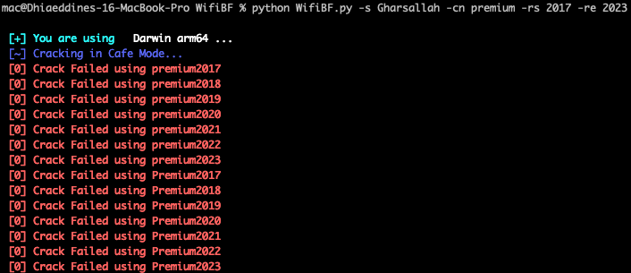

<h1 align="center">
  <br>
  WIFI-Brute-Force V1.2
  <a></a>
  </br>
  </h1>

### Why this project ?
As a software engineer who works in cafes sometimes. After noticing that most passwords in cafes follow a similar pattern which is "the_cafe_name" concatenated with "a_year" like Friends2019 or doncafe2021.
Sometimes the cafe name is camel cased and sometimes it isn't so I decided to build on top of an existing wifi password cracker to create this custom cafe wifi cracker based on the cafe name and a range of numbers for the years to be tried so that we don't have to call the cafe owners to ask for the Wifi password! Why? Cuz we are sofware engineers! :D

### How to use ?

```
    usage: [options]
      -h , --help           show this help message and exit
      -s , --ssid           SSID WIFI Target
      -w , --wordlist       list of passwords
      -cn, --cafe-name      the cafe name
      -rs, --range-start    the range start of the years to try
      -re, --range-end      the range end of the years to try
      -v , --version        version
```

Sample use case:
```
  python WifiBF.py -s Gharsallah -cn premium -rs 2017 -re 2023
```



### How to use it in your Mac ?  
This project can run well on Windows and Linux. 
Because the dependent module pywifi support for Windows and Linux but not Mac,   
here is the way to use WIFI-Brute-Force in Mac.  
#### Step 1. install anaconda
Go https://www.anaconda.com/distribution/ to download anaconda and install it.  

#### Step 2. Use conda to install pywifi for mac
macos_dev branch is a pywifi project for Mac with python 3.5
pyobjc is dependent module for mac pywifi module
```
  $ conda create -n wifi-brute-force python=3.5  
  $ conda activate wifi-brute-force    
  $ git clone -b macos_dev https://github.com/awkman/pywifi.git  
  $ cd pywifi  
  $ pip install pyobjc   
  $ pip install .  
```
Now pywifi module for Mac is ready in conda environment, named wifi-brute-force  
You can enjoy WIFI-Brute-Force.  


### _🕷️ Available command line options_
[`CopyRight`](https://github.com/BrahimJarrar/)

    usage: [options]
      -h , --help           show this help message and exit
      -s , --ssid           SSID WIFI Target
      -w , --wordlist       list of passwords
      -t , --threads        number of threads #Comming soon
      -v , --version        version

-------------------------------------

<h1 align="center">
  <br>
  <a href="https://github.com/BrahimJarrar/"></a>
  </br>
</h1>
